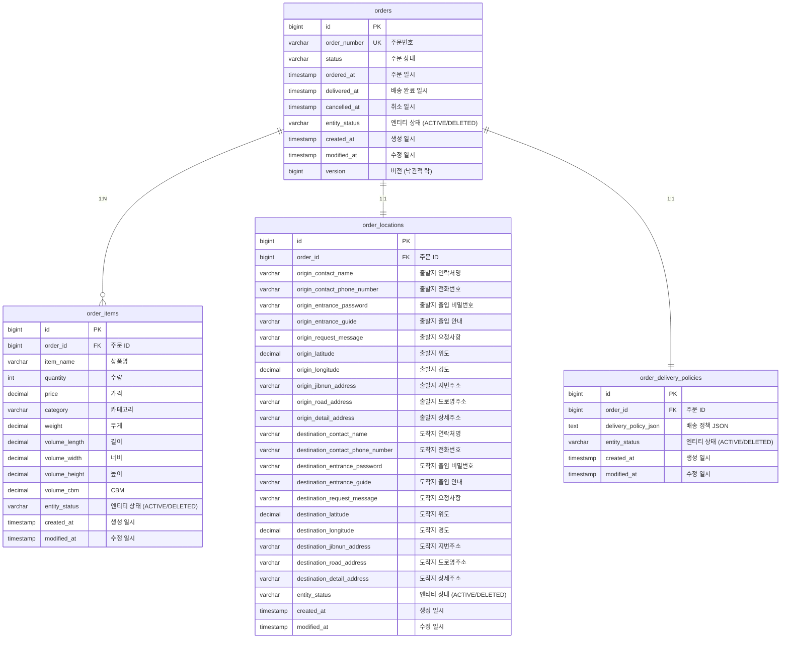

# Order Service ERD

## 엔티티 관계도

## 공통 필드 (BaseEntity)

모든 테이블은 `BaseEntity` 또는 `ConcurrentEntity`를 상속받습니다.

### BaseEntity
- `id`: Primary Key (bigint, auto increment)
- `entity_status`: 엔티티 상태 (ACTIVE/DELETED) - Soft Delete 지원
- `created_at`: 생성 일시 (timestamp, not null, updatable=false)
- `modified_at`: 수정 일시 (timestamp, not null, 자동 업데이트)

### ConcurrentEntity (BaseEntity 상속)
- `version`: 낙관적 락(Optimistic Lock)을 위한 버전 필드 (bigint, not null)
- 동시성 제어가 필요한 테이블에 적용

## 테이블 설명

### orders (주문) - **ConcurrentEntity 상속**
- 주문의 기본 정보를 저장
- `order_number`: 비즈니스 키로 사용되는 주문번호 (UK)
- `status`: 주문 상태 (ENUM)
- `version`: 동시성 제어 (낙관적 락)
- 주문/배송완료/취소 시간 추적

### order_items (주문 상품) - **BaseEntity 상속**
- 주문에 포함된 상품들의 정보
- 상품의 물리적 특성(무게, 부피) 포함
- 1개 주문에 여러 상품 가능 (1:N 관계)

### order_locations (주문 위치) - **BaseEntity 상속**
- 주문의 출발지와 도착지 정보
- 연락처, 주소, 위치정보, 출입안내 등 포함
- 1개 주문당 1개 위치정보 (1:1 관계)

### order_delivery_policies (주문 배송 정책) - **BaseEntity 상속**
- 배송 정책을 JSON 형태로 저장
- 복잡한 배송 규칙을 유연하게 저장
- 1개 주문당 1개 배송정책 (1:1 관계)

## 관계 설명

1. **orders ↔ order_items**: 1:N 관계
   - 하나의 주문에 여러 상품이 포함될 수 있음

2. **orders ↔ order_locations**: 1:1 관계
   - 하나의 주문에 하나의 위치정보(출발지+도착지)

3. **orders ↔ order_delivery_policies**: 1:1 관계
   - 하나의 주문에 하나의 배송정책