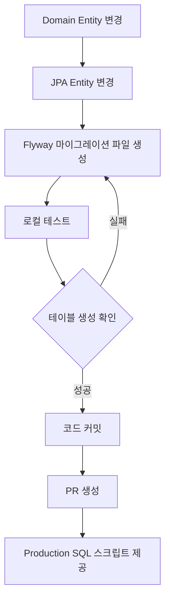

# Flyway 마이그레이션 가이드

## 🎯 개요

Flyway를 사용하여 데이터베이스 스키마를 버전 관리합니다.

- **Local 환경**: Flyway가 자동으로 마이그레이션 실행
- **Production 환경**: DBA가 수동으로 SQL 스크립트 실행

---

## 📂 마이그레이션 파일 위치

```
infrastructure/src/main/resources/db/migration/
└── V{YYYYMMDD}_{NNN}__{Description}.sql
```

**예시:**
```
V20250106_001__Create_order_aggregate.sql
V20250107_001__Add_order_status_column.sql
V20250107_002__Add_index_on_order_number.sql
```

---

## 📝 파일 네이밍 규칙

### 형식
```
V{YYYYMMDD}_{NNN}__{Description}.sql
```

- **V**: Version prefix (필수, 대문자)
- **YYYYMMDD**: 날짜 (8자리)
- **NNN**: 일련번호 (3자리, 001부터 시작)
- **__**: 구분자 (언더스코어 2개)
- **Description**: 영문 설명 (Snake_case)

### 예시
- ✅ `V20250106_001__Create_order_aggregate.sql`
- ✅ `V20250107_001__Add_order_status_index.sql`
- ✅ `V20250107_002__Alter_order_table_add_memo.sql`
- ❌ `V1__create_order.sql` (날짜 형식 불일치)
- ❌ `V20250106_1__create_order.sql` (일련번호 3자리 아님)

---

## 🔄 Entity 변경 시 마이그레이션 추가 규칙

### 원칙
**Domain Entity나 JPA Entity가 변경되면 반드시 Flyway 마이그레이션 파일을 추가해야 합니다.**

### 체크리스트

#### 1. Domain Entity 변경
```java
// core/domain/order/Order.java
@Getter
@Builder
public class Order {
    private Long id;
    private String orderNumber;
    private OrderStatus status;
    private String memo;  // ⭐ 새로운 필드 추가
    // ...
}
```

#### 2. JPA Entity 변경
```java
// infrastructure/storage/db/order/entity/OrderJpaEntity.java
@Entity
@Table(name = "orders")
public class OrderJpaEntity {
    @Id
    private Long id;
    
    @Column(name = "order_number")
    private String orderNumber;
    
    @Column(name = "memo")  // ⭐ 새로운 컬럼 추가
    private String memo;
    // ...
}
```

#### 3. Flyway 마이그레이션 파일 생성
```sql
-- infrastructure/src/main/resources/db/migration/V20250107_001__Add_order_memo_column.sql

-- 주문 테이블에 메모 컬럼 추가
ALTER TABLE orders 
ADD COLUMN memo VARCHAR(1000) NULL COMMENT '주문 메모';

-- 인덱스 추가 (필요시)
-- CREATE INDEX idx_orders_memo ON orders(memo);
```

---

## 📋 변경 타입별 가이드

### 1. 새로운 Aggregate Root 추가
**파일명:** `V{YYYYMMDD}_001__Create_{aggregate_name}_aggregate.sql`

**예시:** `V20250106_001__Create_order_aggregate.sql`

**내용:**
- 모든 테이블 생성 (Aggregate Root + 관련 Entity)
- 인덱스 생성
- Foreign Key 제약조건
- 초기 데이터 (필요시)

```sql
-- 주문 테이블
CREATE TABLE orders (
    id BIGINT NOT NULL AUTO_INCREMENT,
    order_number VARCHAR(50) NOT NULL,
    status VARCHAR(20) NOT NULL,
    PRIMARY KEY (id),
    UNIQUE KEY uk_order_number (order_number)
) ENGINE=InnoDB DEFAULT CHARSET=utf8mb4 COMMENT='주문';

-- 주문 아이템 테이블
CREATE TABLE order_items (
    id BIGINT NOT NULL AUTO_INCREMENT,
    order_id BIGINT NOT NULL,
    item_name VARCHAR(100) NOT NULL,
    PRIMARY KEY (id),
    FOREIGN KEY (order_id) REFERENCES orders(id)
) ENGINE=InnoDB DEFAULT CHARSET=utf8mb4 COMMENT='주문 아이템';
```

### 2. 컬럼 추가
**파일명:** `V{YYYYMMDD}_{NNN}__Add_{table}_{column}_column.sql`

**예시:** `V20250107_001__Add_order_memo_column.sql`

```sql
-- 컬럼 추가
ALTER TABLE orders 
ADD COLUMN memo VARCHAR(1000) NULL COMMENT '주문 메모';

-- 기본값 설정 (선택)
UPDATE orders SET memo = '' WHERE memo IS NULL;

-- NOT NULL 제약 추가 (필요시)
-- ALTER TABLE orders MODIFY COLUMN memo VARCHAR(1000) NOT NULL;
```

### 3. 컬럼 변경
**파일명:** `V{YYYYMMDD}_{NNN}__Alter_{table}_{column}.sql`

**예시:** `V20250107_002__Alter_order_memo_increase_length.sql`

```sql
-- 컬럼 타입 변경
ALTER TABLE orders 
MODIFY COLUMN memo VARCHAR(2000) NULL COMMENT '주문 메모 (길이 증가)';
```

### 4. 인덱스 추가
**파일명:** `V{YYYYMMDD}_{NNN}__Add_index_on_{table}_{column}.sql`

**예시:** `V20250107_003__Add_index_on_order_number.sql`

```sql
-- 단일 컬럼 인덱스
CREATE INDEX idx_orders_order_number ON orders(order_number);

-- 복합 인덱스
CREATE INDEX idx_orders_status_created_at ON orders(status, created_at);
```

### 5. 테이블 삭제
**파일명:** `V{YYYYMMDD}_{NNN}__Drop_{table}_table.sql`

**예시:** `V20250107_004__Drop_old_order_history_table.sql`

```sql
-- 외래키 제약조건 먼저 삭제
ALTER TABLE order_items DROP FOREIGN KEY fk_order_history;

-- 테이블 삭제
DROP TABLE IF EXISTS order_history;
```

---

## 🔄 워크플로우

### Entity 변경 시 전체 흐름



### 1. Domain Entity 변경
```java
// core/domain/order/Order.java
private String memo;  // 필드 추가
```

### 2. JPA Entity 변경
```java
// infrastructure/storage/db/order/entity/OrderJpaEntity.java
@Column(name = "memo")
private String memo;
```

### 3. Flyway 마이그레이션 파일 생성
```sql
-- infrastructure/src/main/resources/db/migration/V20250107_001__Add_order_memo_column.sql
ALTER TABLE orders ADD COLUMN memo VARCHAR(1000) NULL;
```

### 4. 로컬 테스트
```bash
# 1. Docker MySQL 실행
cd scripts
docker-compose up -d

# 2. 애플리케이션 실행 (Flyway 자동 실행)
cd ..
./gradlew clean :api:bootRun

# 3. 테이블 확인
docker exec order-mysql mysql -u order_user -porder_password order -e "DESC orders;"

# 4. Flyway 이력 확인
docker exec order-mysql mysql -u order_user -porder_password order -e "SELECT * FROM flyway_schema_history;"
```

### 5. 확인 사항
- ✅ 애플리케이션이 정상 시작되는가?
- ✅ Flyway 마이그레이션이 성공했는가?
- ✅ 테이블에 컬럼이 추가되었는가?
- ✅ 기존 데이터가 유지되는가?

---

## ⚠️ 주의사항

### 1. 절대 하지 말 것
- ❌ **이미 적용된 마이그레이션 파일 수정 금지**
  ```
  V20250106_001__Create_order_aggregate.sql  // 이미 적용됨 → 수정 금지!
  ```
  
- ❌ **같은 날짜에 일련번호 중복 금지**
  ```
  V20250107_001__Add_column_A.sql
  V20250107_001__Add_column_B.sql  // ❌ 일련번호 중복!
  ```

- ❌ **JPA `ddl-auto` 의존 금지**
  ```yaml
  # application.yml
  spring:
    jpa:
      hibernate:
        ddl-auto: none  # 반드시 none!
  ```

### 2. 반드시 해야 할 것
- ✅ **롤백 스크립트 준비**
  ```sql
  -- V20250107_001__Add_order_memo_column.sql
  ALTER TABLE orders ADD COLUMN memo VARCHAR(1000) NULL;
  
  -- 롤백 스크립트 (별도 보관)
  -- ALTER TABLE orders DROP COLUMN memo;
  ```

- ✅ **Production 적용 전 Staging 테스트**
  
- ✅ **대용량 테이블 변경 시 점검 시간 확보**

---

## 🗂️ Flyway 설정

### FlywayConfig.java
```java
// infrastructure/common/config/FlywayConfig.java
@Configuration
@Profile("local")  // Local 환경에서만 실행
class FlywayConfig {
    
    @Bean(initMethod = "migrate")
    public Flyway flyway(DataSource dataSource) {
        return Flyway.configure()
            .dataSource(dataSource)
            .locations("classpath:db/migration")      // 마이그레이션 파일 위치
            .baselineOnMigrate(true)                  // 기존 DB 허용
            .baselineVersion("0")                     // Baseline 버전
            .validateOnMigrate(true)                  // 검증 활성화
            .outOfOrder(false)                        // 순서 엄격
            .cleanDisabled(true)                      // Clean 비활성화
            .load();
    }
}
```

### application.yml
```yaml
spring:
  jpa:
    hibernate:
      ddl-auto: none  # ⭐ Flyway가 스키마 관리
    
  # Local 환경에서만 Flyway 활성화
  profiles:
    active: local
```

---

## 📊 Flyway 명령어

### 로컬 개발 시
```bash
# 1. 마이그레이션 상태 확인
docker exec order-mysql mysql -u order_user -porder_password order \
  -e "SELECT * FROM flyway_schema_history ORDER BY installed_rank;"

# 2. 현재 스키마 확인
docker exec order-mysql mysql -u order_user -porder_password order \
  -e "SHOW TABLES;"

# 3. 특정 테이블 구조 확인
docker exec order-mysql mysql -u order_user -porder_password order \
  -e "DESC orders;"

# 4. DB 초기화 (개발 시)
cd scripts
docker-compose down -v  # 볼륨 삭제
docker-compose up -d
```

### Production 환경
```bash
# DBA가 수동으로 실행
mysql -h {host} -u {user} -p{password} {database} < V20250107_001__Add_order_memo_column.sql

# 마이그레이션 이력 수동 등록
INSERT INTO flyway_schema_history (installed_rank, version, description, type, script, checksum, installed_by, execution_time, success)
VALUES (2, '20250107.001', 'Add order memo column', 'SQL', 'V20250107_001__Add_order_memo_column.sql', NULL, 'dba', 100, 1);
```

---

## 📚 참고 자료

- [Flyway Documentation](https://flywaydb.org/documentation/)
- [Flyway Naming Convention](https://flywaydb.org/documentation/concepts/migrations#naming)
- [Flyway MySQL Guide](https://flywaydb.org/documentation/database/mysql)

---

## ✅ 체크리스트

Entity 변경 시 다음을 확인하세요:

- [ ] Domain Entity가 변경되었는가?
- [ ] JPA Entity가 변경되었는가?
- [ ] Flyway 마이그레이션 파일을 생성했는가?
- [ ] 파일명이 네이밍 규칙을 따르는가?
- [ ] 로컬에서 테스트했는가?
- [ ] 테이블 변경사항이 정확한가?
- [ ] 롤백 스크립트를 준비했는가?
- [ ] Production SQL 스크립트를 문서화했는가?
